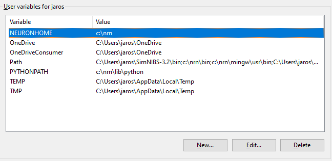
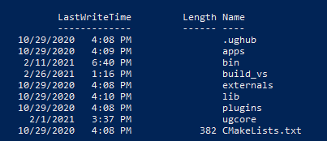
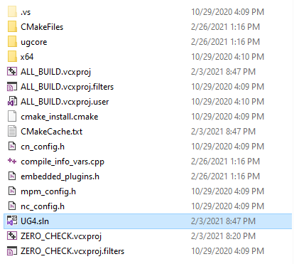

# James-UG4-Installation-Codes

These are small shell scripts for installing ug4 on different operating systems.
There is also a pdf on how to manually install ug4 step by step. In general you will need the following:

** These are Requirements**

- C++ Compiler (tested with GCC on Linux, Clang on macOS and MSVC 2017 on Windows)
- CMake >= 2.8
- ughub (https://github.com/UG4/ughub)
- git
- python

# On Windows (tested on Windows 10)
You will need the following prerequisites for installation:
 - For installation on Windows you will need to use PowerShell which can be found [here](https://docs.microsoft.com/en-us/powershell/), follow the download and install instructions.
 - You will also need a recent versions of Visual Studio (VS 2017 or VS 2019) which can be found here: [visual studio](https://visualstudio.microsoft.com/)
 - You will also need cmake for Windows here [cmake](https://cmake.org/install/)
 - You will also need [Python](https://www.python.org/downloads/windows/)

You made need to add Python to the system path variable, information on how to do this is found [here](https://superuser.com/questions/949560/how-do-i-set-system-environment-variables-in-windows-10)

In the environment variables Python should already be there, if not you may need to add it.
If you installed Yale Neuron already, then it should already be in the path like in the figure below, if not you need to add it.

Steps to installing ug4 on Windows 10
1. Downd the <code>UG4install.ps1</code> file and place it in the home directory of your user account. 
2. Open <code>PowerShell</code> command prompt and navigate to the folder that contains <code>UG4install.ps1</code> from Step 1.
3. Then execute <code>.\UG4install.ps1</code>
4. Then when Step 3. is complete, execute <code>ls</code>, in the directory there should be two folders called <code>ug4</code> and <code>ughub</code>
5. In <code>PowerShell</code> navigate to inside <code>ug4</code> and execute <code>ls</code> you should see below

6. Now open a Windows explorer window and navigate to the <code>build_vs</code> that is located inside <code>ug4</code>

7. Open the <code>UG4.sln</code> in either VS2017 or VS2019 whichever one you have.